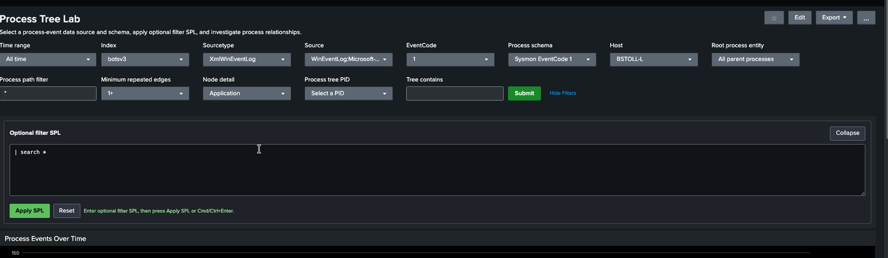
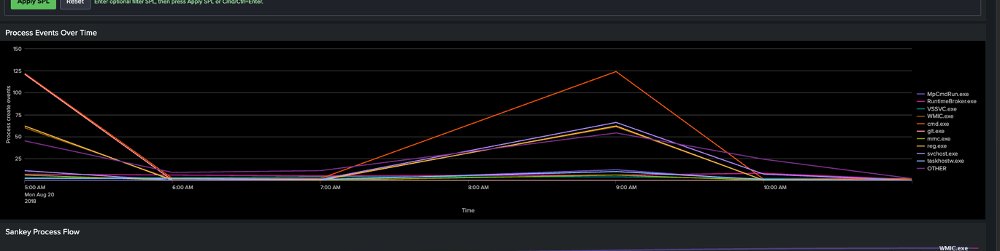
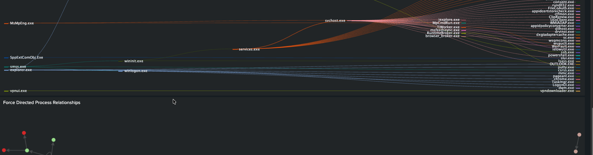
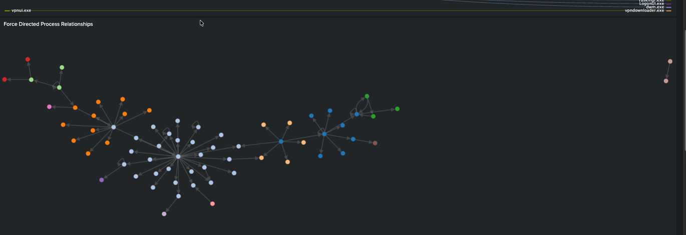
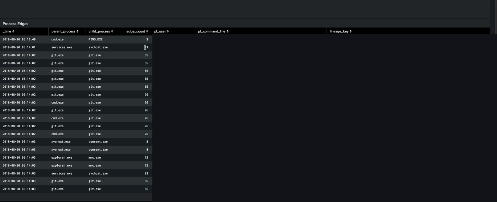
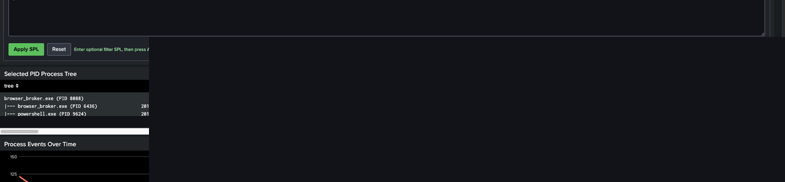
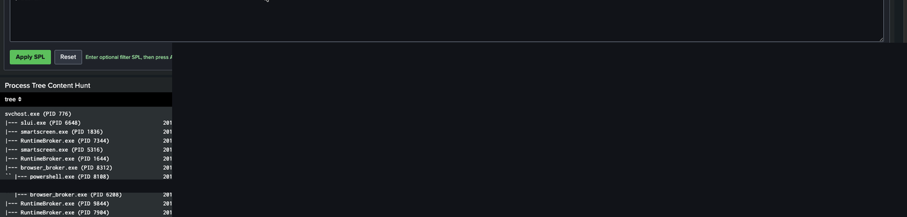
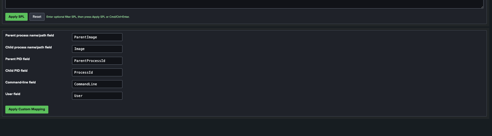
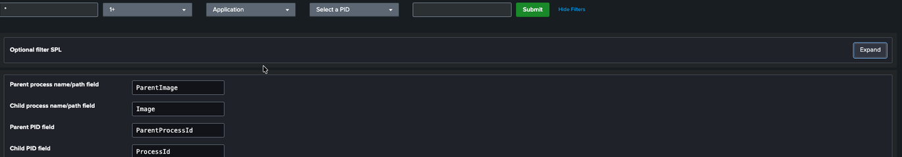

# Process Tree Lab Screenshots

Screenshots were captured from Process Tree Lab 1.0.4 on Splunk Enterprise 10.4.1 using the synthetic BOTS v3 dataset. Browser chrome and unrelated applications were cropped out before publication. User values, command lines, lineage identifiers, user-profile paths, GUID details, and encoded command payloads are masked where they appear in result panels.

## Controls and optional filter SPL

## Process Events Over Time

## Sankey Process Flow

## Force Directed Process Relationships

## Process Edges

## Selected PID Process Tree

The example uses the synthetic BOTS v3 `BSTOLL-L` host and `powershell.exe` PID 9624.

## Process Tree Content Hunt

The example uses the literal hunt text `powershell.exe` and the app's bounded tree output.

## Custom field mapping

## Collapsed optional filter SPL

